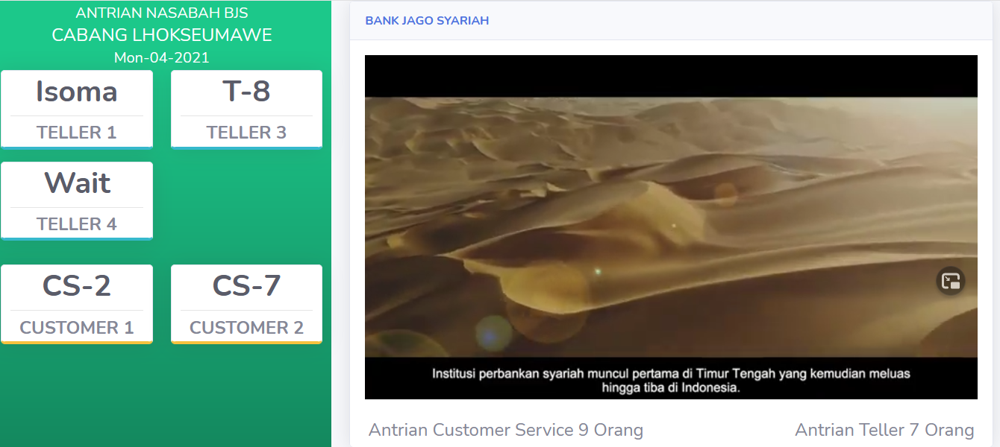
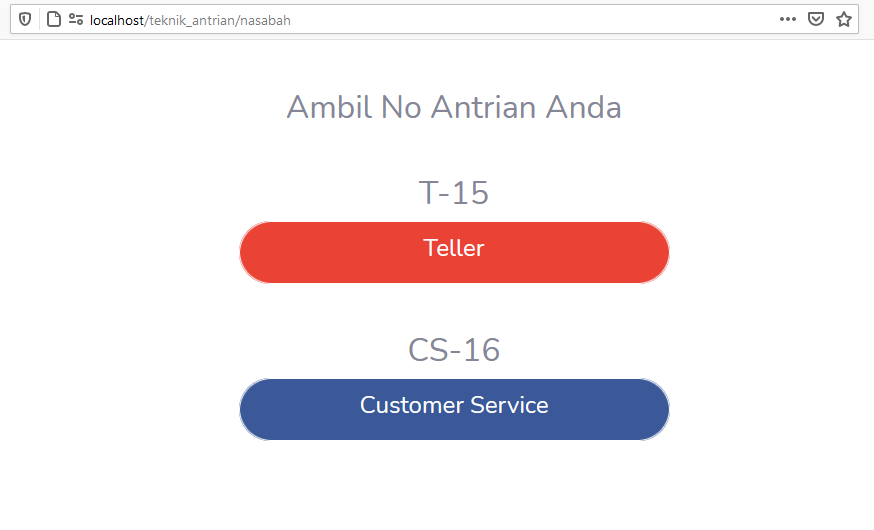
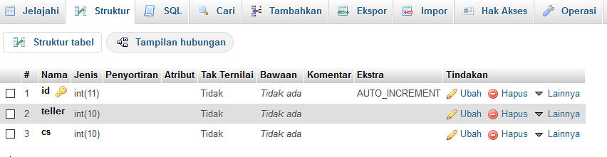
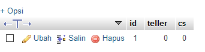

# Pratikum Teknik Modulasi
## Pertemuan 8: Membuat halaman untuk pengambilan tiket
Pertemuan sebelumnya kita sudah berhasil membuat laman Dashboard dimana laman tersebut menampilkan petugas yang aktif dan no Antrian yang sedang dilayani.


Selanjutnya kita akan membuat laman Nasabah untuk mengambil Nomor Antrian 



dalam hal ini langkah pertama yang kita lakukan adalah merancang tabel baru yang diberi nama nasabah dengan struktur seperti dibawah ini:


lalu isi tabel tersebut dengan nilai awal<br>


### Langkah 1
Buat sebuah controller dengan nama Nasabah.php dengan syntaks sebagai berikut
```php
<?php
defined('BASEPATH') or exit('No direct script access allowed');

class Nasabah extends CI_Controller
{
    public function __construct()
    {
        parent::__construct();
    }
    public function index()
    {
        $data['nasabah'] = $this->db->get('nasabah')->result_array();
        $this->load->view('header', $data);
        $this->load->view('nasabah');
        $this->load->view('footer');
    }
    public function teller($antri = '')
    {
        $data = [
            "teller" => $antri + 1
        ];
        $this->db->update('nasabah', $data);
        $data['nasabah'] = $this->db->get('nasabah')->result_array();
        $this->load->view('tiket_teller', $data);
        redirect("nasabah");
    }
    
}
```
`file diatas diletakan dalam folder applicaton/controller`
ada 2 function yang harus diperhatikan pada program diatas yaitu index dan teller<br>
```
 public function index()
    {
        $data['nasabah'] = $this->db->get('nasabah')->result_array();
        $this->load->view('header', $data);
        $this->load->view('nasabah');
        $this->load->view('footer');
    }
```
karena diletakan pada function index maka program diatas akan di jalankan pertama sekali ketika controller nasabah dipanggil.<br>
`$data['nasabah'] = $this->db->get('nasabah')->result_array();` syntax ini membuat query untuk menampilkan seluruh isi tabel nasabah dan kita tampung dalam variabel nasabah yang nanti akan dikirim ke file view/nasabah melalui $data<br>
dan perintah selanjutnya menampilkan file header, nasabah, footer yang disimpan dalam folder view. diantara tiga file tersebut file header dan footer sudah kita buat di pertemuan sebelumnya.<br>
```
 public function teller($antri = '')
    {
        $data = [
            "teller" => $antri + 1
        ];
        $this->db->update('nasabah', $data);
        $data['nasabah'] = $this->db->get('nasabah')->result_array();
        $this->load->view('tiket_teller', $data);
        redirect("nasabah");
    }
```
`public function teller($antri = '')` pada nama function terdapat parameter antri yang berfungsi mengambil no antrian terakhir yang dikirim melalui address bar pada saat tombol teller ditekan<br>
```
$data = [
         "teller" => $antri + 1
        ];
$this->db->update('nasabah', $data);
```
no antrian teller terakhir ditambahkan 1 (increment) lalu diupdate ke tabel nasabah <br>
`$this->load->view('tiket_teller', $data);` memanggil halaman yang mencetak no antrian<br>
`redirect("nasabah");` mengembalikan ke function index setelah no antrian berhasil dicetak, untuk melihat proses cetak boleh memngomentari script ini.
### Langkah 2
Buat sebuah file dengan nama `nasabah.php` pada folder `aplication/view`  
```php
    <div class="container pt-5">
        <div class="h2 text-center mb-3">Ambil No Antrian Anda</div>
        <form class="user col-5 mx-auto">

            <div class="h2 text-center mt-5">
                <?php foreach ($nasabah as $row) {
                    if ($row['teller'] > 0) {
                        echo 'T-' . $row['teller'];
                    } else {
                        echo "Belum ada antrian";
                    }
                }
                ?>
            </div>
            <a href="<?php echo base_url() ?>nasabah/teller/<?php echo $row['teller'] ?>" class="btn btn-google btn-user btn-block">
                <div class="h4">Teller</div>
            </a>
            <div class="h2 text-center mt-5">
               CS-01
            </div>
            <a href="<?php echo base_url() ?>nasabah/cs/<?php echo $row['cs'] ?>" class="btn btn-facebook btn-user btn-block">
                <div class="h4">Customer Service</div>
            </a>
        </form>
    </div>
```
Penjelasan program diatas
```
<?php foreach ($nasabah as $row) 
{
   if ($row['teller'] > 0) {
       echo 'T-' . $row['teller'];
   } else {
       echo "Belum ada antrian";
   }
}
?>
```
perintah diatas mengambil data yang dikirim dari controller Nasabah melalui variabel nasabah yang menampilkan no antrian teller yang tersimpan dalam tabel nasabah fiels teller.

```
<a href="<?php echo base_url() ?>nasabah/teller/<?php echo $row['teller'] ?>" class="btn btn-google btn-user btn-block">
     <div class="h4">Teller</div>
</a>
```
perintah diatas menampilkan tombol yang apabila diklick akan menjalankan function teller yang terdapat controller Nasabah yang pada saat bersamaan mengirimkan no antrian teller saat ini melalui adress bar yang nantinya akan di gunakan untuk menambahkan no antrian baru pada controler Nasabah.


### Langkah 3
Buat sebuah file dengan nama `tiket_teller.php` pada folder `aplication/view` 
```php
<center>
    <b>
        <h3>No Antrian:</h3>
    </b>
    <b>
        <h1><?php foreach ($nasabah as $row) {

                echo 'T-' . $row['teller'];
            } ?></h1>
    </b>
</center>
<script>
    window.print();
</script>
```
bila program sudah tidak ada kesalahan silahkan jalankan controller Nasabah melalui browser lalu klick tombol teller, bila program berjalan maka no antrian teller akan bertambah 1.


                
